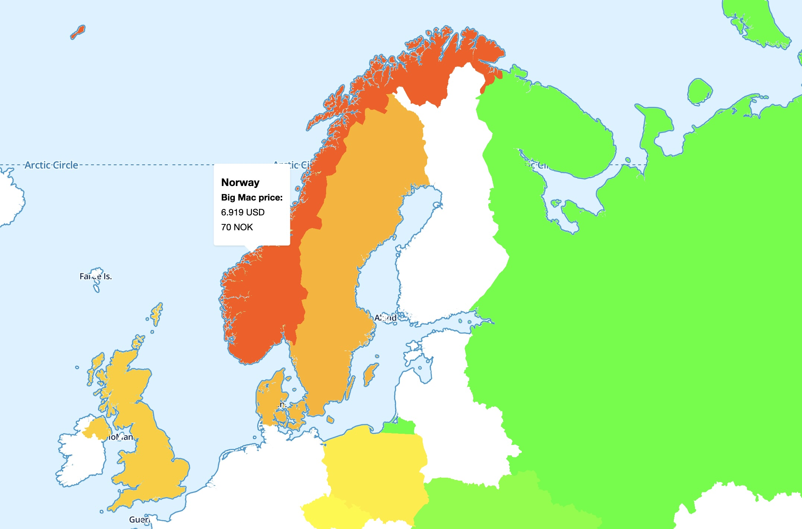

# js2clj2js: Creating JS data from JS data using ClojureScript?

Consider this time budget when loading some data into a JavaScript library: 

| Step       | ms  | Locks UI thread? |
|------------|----:|------|
| fetch      | 40  |  N    |
| json-parse | 431 |  Y/N    |
| js->clj    | 510 |  Y   |
| transform  | 4   |  Y    |
| clj->js    | 359 |  Y    |
| *Total*  | *1344* |  *873 - 1304*    |

vs

| Step       | ms  | Locks UI thread? |
|------------|----:|------|
| fetch      | 40  |  N    |
| json-parse | 431 |  Y/N    |
| transform  | 4   |  Y    |
| *Total*  | *1344* |  *4-435*    |

As Clojure programmers we are keen on using Clojure data. It is immutable and has wonderful facilities for transformation from just about anything to just about anything else. As ClojureScript programmers, we are embedded in JavaScript land, with its mutable objects and inferior transformation help. Often it makes the most sense to convert any JavaScript data when it enters our applications.

However, sometimes we get JavaScript (or more often JSON) in and need to feed JavaScript data to some library. This demo project is about this scenario. As [Mike Fikes warns us](https://blog.fikesfarm.com/posts/2017-11-09-avoid-converting-javascript-objects.html), if the data is large, the convertions can impact the performance of our app, and even make the UI non-responsive. This demo project is about keeping as much of the Clojure ergonomics as we can, while still caring about performance

For the first part of the conversion, from JSON -> Clojure we can [use Transit to speed things up 20-30X](https://swannodette.github.io/2014/07/26/transit-clojurescript/), if we accept that we'll get string keys, instead of keywords keys. “A small price to pay” says David Nolen. I'd say that's controversial. We lose a lot of the Clojure data ergonomics, especially destructuring. Sure, for some situation this tradeoff makes perfect sense. Also, if you control both the server and the client, and use civilized tools (i.e. Clojure and ClojureScript) at both ends, going all in Transit makes a ton of sense.

For the next step of the conversion, from Clojure to JavaScript we don't have a viable alternative to using `clj->js`, afaik. If the performance hit from that is unacceptable, we need to stay in JavaScript land. This demo project sets up a fictional, but not entirely unrealistic, such scenario:

* We consume an API feeding us the latest [BigMac Index](https://www.economist.com/big-mac-index) data together with geographic polygons for the contries of the world.
  - (The “API” is just a static JSON file in this case.)
* We want to present the index as hovers on a world map, and we are using [Maplibre GL JS](https://maplibre.org/), which expects [GeoJSON](https://geojson.org/) shaped JavaScript data.
* Our API has all the data we need, but does not give us GeoJSON.
* Further, the country polygons from our API are not closed, which is a requirement in GeoJSON. _We need to close them._

Thus: We have JSON in, need JavaScript data out, and there is a necessary transformation step in between. The transformation is pretty quick, about 1-4 ms on a fast Mac laptop. If we want to do the work using Clojure data, with its ergonomics, the conversion is not cheap, though. It takes about 500 ms `js->clj`, and about 400 ms `clj-js`, on the same Mac.

You can try the demo app here: https://pez.github.io/js2clj2js/

The demo app has three buttons, all of which give the same result: _The countries of the map are decorated according to their BigMac index, and get a small popup each with some details._ The difference is in _how_ they do it.
* [clj_data.cljs](src/js2clj2js/clj_data.cljs) Button 1 goes the way over Clojure data and then back to JS data
* The other two buttons use [applied-science/js-interop](https://github.com/applied-science/js-interop) to ergonomically work with the JS Data and transform it.
  * [js_data.cljs](src/js2clj2js/js_data.cljs) Button 2 uses macros like `js-interop/defn` and `js-interop/let` to retain the destructuring convenience of Clojure data
  * [js_mode.cljs](src/js2clj2js/js_mode.cljs) Button 3 uses the experimental macro `js-interop.alpha/js` to enter “JS mode” and reach almost to the levels of squint-js in the feeling of working with JavaScript data with the comfort of Clojure.

Both `js-interop` functions have the same performance profile. I just included both to be able to compare their ergonomics.

It's not all bliss, of course. We're still dealing with mutable(!) data. And we do need to sprinkle in teh occasional `#js` tag, and do things like `js-interop/push!`, and don't forget to use `into-array` to create JS arrays out of Clojure vectors/lists. It's price to pay for the performance gain. As small a price as I know about. The performance gain is quite significant in this case. The demo app lets feel the difference. Easiest on a desktop computer:

Instead of using the buttons to run the functions, you can use the keyboard. Keys, `1`, `2`, and `3`, respectively. If you first zoom in on the map, and then start dragging the map around with the mouse. While dragging, press your key of choice and you will notice when the UI thread locks up. Much bigger impact for key `1` than for the other two, right? 