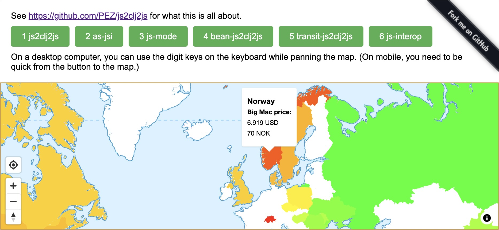

# Balancing performance and developer ergonomics

Do you love Clojure convenience and also need to create a lot of JS data from a lot of JS data using ClojureScript? [applied-science/js-interop](https://github.com/applied-science/js-interop) to the rescue!

[](https://pez.github.io/js2clj2js/)

Consider this time budget when loading some data into a JavaScript library: 

| Step           | ms     | Locks UI thread? |
|----------------|-------:|------|
| fetch          | 40     |  N    |
| response->json | 431    |  Y/N[*](#is-the-ui-thread-locking-or-not)    |
| js->clj        | 510    |  Y   |
| transform      | 0      |  Y    |
| clj->js        | 359    |  Y    |
| *Total*        | *1340* |  *869 <-> 1300*    |

vs

| Step           | ms    | Locks UI thread? |
|----------------|------:|------|
| fetch          | 40    |  N    |
| response->json | 431   |  Y/N[*](#is-the-ui-thread-locking-or-not)    |
| transform      | 1     |  Y    |
| *Total*        | *472* |  *1 <-> 432*    |

As Clojure programmers we are keen on using Clojure data. It is immutable and has wonderful facilities for transformation from just about anything to just about anything else. As ClojureScript programmers, we are embedded in JavaScript land, with its mutable objects and inferior transformation help. Often it makes the most sense to convert any JavaScript data when it enters our applications.

However, sometimes we get JavaScript (or more often JSON) in and need to feed JavaScript data to some library. This demo project is about this scenario. As [Mike Fikes warns us](https://blog.fikesfarm.com/posts/2017-11-09-avoid-converting-javascript-objects.html), if the data is large, the convertions can impact the performance of our app, and even make the UI non-responsive. This demo project is about keeping as much of the Clojure ergonomics as we can, while still caring about performance.

For the first part of the conversion, from JSON -> Clojure we can [use Transit to speed things up 20-30X](https://swannodette.github.io/2014/07/26/transit-clojurescript/), if we accept that we'll get string keys, instead of keywords keys. “A small price to pay” says David Nolen. ~~I'd say that's controversial. We lose a lot of the Clojure data ergonomics, especially destructuring. Sure, for some situations this tradeoff makes perfect sense.~~ Also, if you control both the server and the client, and use civilized tools (i.e. Clojure and ClojureScript) at both ends, going all in Transit makes a ton of sense.

(My bad. See [below](#update-transit) for an update about Transit and string key destructuring.)

For the next step of the conversion, from Clojure to JavaScript we don't have a viable alternative to using `clj->js`, afaik. If the performance hit from that is unacceptable, we need to stay in JavaScript land.

## A playground to get a feel for the trade-offs

This demo project sets up a fictional, but not entirely unrealistic, such scenario:

* We consume an API feeding us the latest [BigMac Index](https://www.economist.com/big-mac-index) data together with geographic polygons for the contries of the world.
  - (The “API” is just a static JSON file in this case.)
* We want to present the index as hovers on a world map, and we are using [Maplibre GL JS](https://maplibre.org/), which expects [GeoJSON](https://geojson.org/) shaped JavaScript data.
* Our API has all the data we need, but does not give us GeoJSON.
* Further, the country polygons from our API are not closed, which is a requirement in GeoJSON. _We need to close them._

Thus: We have JSON in, and need JavaScript data out, and there is a necessary transformation step in between. The transformation is pretty quick, about 1-4 ms on a fast Mac laptop. If we want to do the work using Clojure data, with its ergonomics, the conversion is not cheap, though. It takes about 500 ms `js->clj`, and about 400 ms `clj-js`, on the same Mac.

You can try the demo app here: https://pez.github.io/js2clj2js/

The app has three buttons, all of which give the same result: _The countries of the map are decorated according to their BigMac index + get a hover small popup each with some details._ The difference is in _how_ they do it. _Open the development console and try the buttons._

* [clj_data.cljs](src/js2clj2js/clj_data.cljs) Button 1 goes the way over Clojure data and then back to JS data
* Buttons 2 and 3 use [applied-science/js-interop](https://github.com/applied-science/js-interop) to ergonomically work with the JS Data and transform it.
  * [js_data.cljs](src/js2clj2js/js_data.cljs) Button 2 uses macros like `js-interop/defn` and `js-interop/let` to retain the destructuring convenience of Clojure data
  * [js_mode.cljs](src/js2clj2js/js_mode.cljs) Button 3 uses [the experimental macro `js-interop.alpha/js`](https://github.com/applied-science/js-interop/pull/32) to enter “JS mode” and reach almost to the levels of [squint-js](https://github.com/squint-cljs/squint) in the feeling of working with JavaScript data from the comfort of Clojure.
* Button 4 uses the same transform function as Button 1, but converts to and from Clojure data using [cljs-bean](https://github.com/mfikes/cljs-bean) (see [the update below](#update-cljs-bean) for more on this)
* [clj_data_transit.cljs](src/js2clj2js/clj_data_transit.cljs) Button 5 skips the `response.json()` call and only picks the text from the response object and then we use `transit/read` to turn it in to string-keyed Clojure data, which is almost as convenient to work with as keyword-keyed data, at least considering the performance boost it gives compared to using `js->clj`.
* [js_interop.cljs](src/js2clj2js/js_interop.cljs) Button 6 is the **Embrace  Interop** button, contributed by Thomas Heller. No library is used. No destructuring is enjoyed. Raw JS interop. It's the fastest of the JS data solutions for the transformation step. In fact it is quite a lot faster than using the **js-interop** library, see about [transform performance](#transform-performance) below. For the purpose of the demo app it doesn't make a noticeable difference for the user, but for other apps it may well do.

**NB**: Both the `js-interop` wielding buttons have the same performance profile. They differ in their ergonomics.

It's not all bliss, of course. We're still dealing with mutable(!) data. And we do need to sprinkle in the occasional `#js` tag, and do things like `js-interop/push!`, and try not to forget to use `into-array` to create JS arrays out of Clojure vectors/lists. It's price to pay for the performance gain. As small a price as I know about. The performance gain is quite significant in this case. The demo app lets you _feel_ the difference.

## Transform performance

The transformation happening in the demo app is rather small. We're only dealing with 250 countries. Maybe it holds for many real world scenarios as well, that we don't need to pay too much attention to this step, when the conversion are so performance consuming. Though, it could be that the data has tons of nodes that you need to update, and then the tradeoffs may look different. The demo app can be made to run its transform many times, as a way to simulate such a scenario. Here are the results on my machine running the transforms 1 000 and 10 000 times:

| Approach   | ms 1K runs | ms 10K runs |
|------------|-----------:|------------:|
| clj data   |          0 |           1 |
| js-interop |        100 |        1500 |
| as-jsi     |        800 |       10000 |

**NB**: The transform code, for the JS data implementations does not allow being repeated like I do here. See [below about data corruption](#all-js-interop-implementation-stop-working-at-1k-transforms).

* `clj-data` represents all solutions doing the transform using regular Clojure data transform functions, including the **cljs-bean**, and **Transit** examples.
* `as-jsi` is **applied-science/js-interop**, including **js-mode**.
* `js-interop` is Thomas Heller's “Embrace Interop” contribution, which skips using any library and thus enjoys no destructuring convenience.

The reason I added 10K was that I at least wanted a figure for the Clojure data case. It actually took 0 ms in some of the 10K runs I did, but anyway, on average 1 ms, shall we say? It's at least 3 orders of magnitude faster than raw JS interop for the demo app scenario. 

Raw JS interop is almost a magnitude faster than accepting the overhead added by the **applied-science/js-interop** library.

But when pushed like this, the JS interop implementations have worse problems than being slower than working on Clojure data...

### All JS interop implementation stop working at 1K transforms

When running the transform many times, all the JS interop solutions break in that they produce bad data. It starts happening at around 1K transforms. At 10K it is consistent, the map does not get updated. This is how I run the transform many times:

``` clojure
(defn do-x-times [x f & args]
  (first (mapv (fn [_]
                 (apply f args))
               (range x))))
               
(do-x-times 1000 clj-data/->geo-json clj-input)
```

Why this would make the data corrupt is beyond me. But, yeah, it is mutable data we are dealing with...

Comment from Thomas Heller about this:

> Correct, the answer is mutation of the input data.
>
> For example my close-coords implementation adds the first element to the end by mutating the existing array. Of course if you keep repeating that it just keeps growing one item per repeat. Nevermind the fact that this probably breaks the polygon rendering, it means after 1k runs the array is +1k items for each single polygon array. I don't even know what that amount to in total, but I'm not surprised it blows up.
>
> You could of course just change the implementation to do a defensive copy and not mutate the source inputs and there may be reasons to do that. It was not my impression that the benchmark should be doing that, but it is a one line change.

That makes sense. And I think this also means that the problem is probably skewing the performance measures wildly. We shouldn't take those seriously without further investigation/fixing the problem in the direction Thomas points.

## I love `js->clj` ❤️

Working with JavaScript data isn't exactly civilized business. It's mainly something that comes with the trade and performance considerations may in situations as those above close the door to using Clojure data for the job. In many other situations it doesn't matter. Even if you get JSON in and need JS data out. When the data structure is small taking the pains and risks involved with mutating data aren't worth the unnoticeable performance differences.

In other situations bringing in dependencies such as the **js-interop** library aren't worth it. Reading `(some-> event .-target .-value)` is very clear.

Anyway, when the performance hit is noticeable by the user, and transformation is involved, and you do not want to forsake conveniences such as superior destructuring, then **js-interop** is your friend. It lets you keep much of your ergonomics while delivering performance to the user. Especially if **js-mode** leaves the experimental stage.

## Update: cljs-bean

On X, [Martin Klepsch made me aware](https://twitter.com/martinklepsch/status/1770384388565397941) of yet another option: [cljs-bean](https://github.com/mfikes/cljs-bean). It offers full Clojure ergonomics for transforming data, at least for the use case in this project. I do not dare describe how it works, but I think that `bean/->clj` sort of puts a “layer” of Clojure data access on the JS data and that this lets all Clojure functions work on it. And to convert to JS we then use `bean/->js`. The demo app is updates with a button for utilizing this, as mentioned above. Here's how the the time budget is spent.

| Step           | ms    | Locks UI thread? |
|----------------|------:|------|
| fetch          | 40    |  N    |
| response->json | 431   |  Y/N[*](#is-the-ui-thread-locking-or-not)    |
| beam->clj      | 0     |  Y   |
| transform      | 0     |  Y    |
| beam->js       | 500   |  Y    |
| *Total*        | *971* |  *500 <-> 931*    |

Two things sticks out:

1. The “conversion” to Clojure data takes so little time that it can't be measured
2. The conversion back to JS data takes significantly more time than with regular Clojure data and `clj->js`
   * But not nearly as much time as we gain from the conversion to Clojure data taking no time at all

This means that **beam-cljs** is not a viable option for the use case in this article/demo app. But for cases where you get JSON/JS in and do not need to produce JS data out it is bloody excellent! This find alone made it worth spending the time writing this article and app.

## Update: Transit

At [/r/clojure I learnt that you can too destructure string keys](https://www.reddit.com/r/Clojure/comments/1bja3cf/comment/kvqfv34/?utm_source=share&utm_medium=web3x&utm_name=web3xcss&utm_term=1&utm_content=share_button), using `:strs` instead of `:keys`. This changes the ergonomics calculation for the Transit option a lot, so I have now added a Transit example to the demo app. Here's the time budget:

| Step              | ms     | Locks UI thread? |
|-------------------|-------:|------|
| fetch             | 40     |  N    |
| response->string  | 267    |  Y/N[*](#is-the-ui-thread-locking-or-not)    |
| transit-json->clj | 216    |  Y   |
| transform         | 0      |  Y    |
| clj->js           | 359    |  Y    |
| *Total*           | *882*  |  *575 <-> 842*    |

We can see that David Nolen was very right about performance gains between `js->clj` and using `transit/read`. In addition to that we don't need to use JS to convert the response to JSON, so we save time there as well. This is quite much better, performance-wise than the naïve `js->clj` approach. And about the small price we pay, string key destructuring is very convenient! We are still locking the UI thread much longer than when using js-interop, though, so it is not really an option for the use case of the demo scenario.

## Is the UI thread locking or not?

The reason the `response->json` and `response->text` steps are listed as both locking and not locking, is that, as far as I understand things, the calls are spent partially on fetching data (non-locking) and part of the call is spent on parsing to json (locking) or converting to a string (locking). The *Total* for the *Locks UI thread?* column is given as a range because of this unknown part. I think that it is safe to assume that most of the time is fetching (i.e. non.locking)? I mean, how long time could it take to get the text out of the response object?